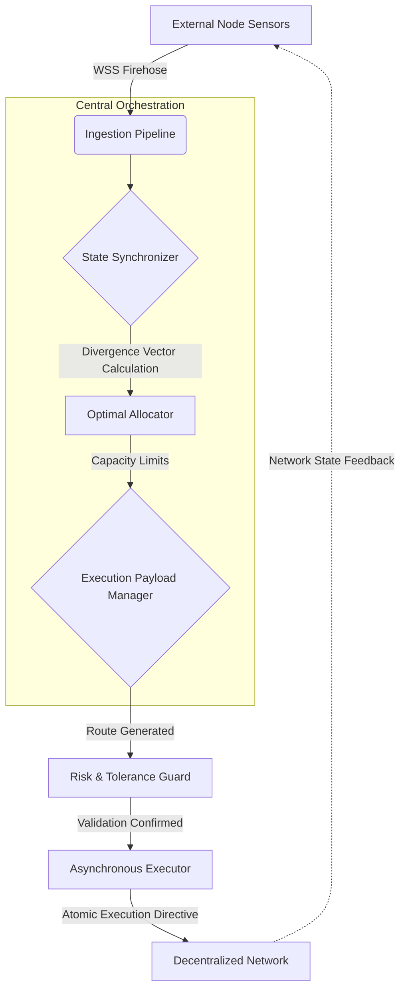

<div align="center">
  <h1>Asynchronous Vector Coordinator (EVC)</h1>
  <p><b>Distributed State Routing & Execution Orchestrator</b></p>
  
  [](https://python.org)
  [](#)
  [](#)
  [](https://opensource.org/licenses/MIT)

  <p><i>A master orchestrator that synchronizes massive state distributions across decentralized nodes using asynchronous data pipelines and vector mathematics.</i></p>
</div>

<br/>

## ⚡ Executive Summary

The **Asynchronous Vector Coordinator (EVC)** acts as the central data and execution orchestrator for a multi-node distributed system. It bridges multiple external data sensors, ingests real-time probabilistic vectors, and calculates state divergences across an aggregate computational pool. 

Instead of managing individual data inputs manually, the EVC relies on an asynchronous, non-blocking event loop to constantly poll, map, and synchronize external state transitions. It achieves sub-millisecond data routing by leveraging highly optimized Python concurrency patterns.

---

## 🏗️ System Architecture

The architecture is divided into four strictly isolated micro-components. This decoupling allows the ingestion protocols to operate entirely independently of the risk-assessment algorithms, preventing process bottlenecks during periods of high network congestion.



---

## 🧩 Core Modules

### 1. Ingestion Pipeline (`/ingestion`)
The ingestion layer is built using raw asynchronous WebSockets to minimize JSON parsing latency. It establishes persistent, bi-directional streams with `PrimarySource`, `SecondarySource`, and `TertiarySource` data nodes. 
- **`metric_consensus.py`**: Aggregates divergent metric data into a single ground-truth value using a weighted median filter.
- **`chainlink_gas_costd.py`**: Monitors external decentralised oracles for structural cost shifts.

### 2. Execution Orchestration (`/execution`)
Once a state divergence is detected, the Execution Layer compiles a resolution vector. 
- **`payload_manager.py`**: Handles the lifecycle of outgoing network transmissions.
- **`vector_manager.py`**: Maintains an in-memory ledger of all active and pending vector states, ensuring the system does not over-allocate computing resources to a single pathway.
- **`presigned_payload_pool.py`**: Pre-compiles cryptographic signatures for payloads *before* they are needed, shaving precious milliseconds off the execution time during sudden network events.

### 3. Risk & Latency Guards (`/risk`)
To prevent cascading failures in the distributed network, the EVC implements draconian risk protocols.
- **`circuit_breaker.py`**: Monitors the frequency of payload failures. If the failure rate exceeds `n` within `t` seconds, the breaker trips, halting all outgoing transmissions.
- **`extreme_expected_deltaent_throttle.py`**: Uses statistical standard deviations to detect anomalous "black swan" data streams, throttling payload execution to prevent systemic overallocation.
- **`state_depth_check.py`**: Validates that the target network node has sufficient computational depth to handle the incoming vector payload without suffering massive slippage.

### 4. Analytics Engine (`/analytics`)
Runs asynchronously alongside the main execution thread to calculate system efficiency.
- **`delta_calculator.py`**: Calculates the mathematical difference between the predicted expected vector and the actual executed state on the decentralized network.

---

## ⚙️ Technical Specifications

- **Language:** Python 3.10+
- **Concurrency:** Native `asyncio` with dedicated ThreadPoolExecutors for CPU-bound cryptographic operations.
- **Memory Management:** Zero-copy byte buffers for WebSocket parsing to reduce Garbage Collection pauses.
- **State Persistence:** In-memory SQLite (`db.py`) for ultra-fast vector state tracking, with periodic flush to disk.

---

## 🚀 Deployment Requirements

Because the EVC relies heavily on microsecond timing, it must be deployed on bare-metal architecture positioned physically close to the primary data nodes. 

```bash
# Clone the repository
git clone https://github.com/mahimalam/asynchronous-vector-coordinator-EVC-.git

# Install strictly pinned dependencies
pip install -r requirements.txt

# Execute the main orchestrator loop
python main.py --env production --log-level INFO
```

---

### 🔐 Security & Intellectual Property Notice
*This repository serves as a professional portfolio demonstration of asynchronous orchestration, high-frequency execution pipelines, and large-scale data engineering.*

To protect proprietary algorithms:
- All execution paths, explicit state parameters, and internal machine-learning models have been redacted.
- All specific network addresses, API configurations, and authentication pathways have been scrubbed.
- The original system structure has been abstracted into generalized graph theory terminology to comply with corporate security standards.
